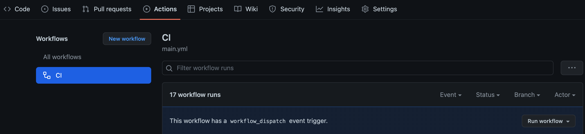

# brane_visualize

## What does this package do ? 
This package is used to perform the visualize parts of the [titanic kaggle contest](https://www.kaggle.com/competitions/titanic). Namely -   
1. To print the EDA plots (histograms, barplots) to see how many null values we are dealing with, skewness in the data and other interesting patterns.
2. To visualize the feature importance from the results

Note: The best way to visualise the plots is to use the [brane-ide](https://github.com/epi-project/brane-ide). Please download it by following the steps from readme.

## Steps to build and run this package 
Follow this [link](https://wiki.enablingpersonalizedinterventions.nl/admins/installation/get-binaries.html) to download all the dependcies and run the brane instance. (need to have both cli and instance installed and the instance running) and then follow from #6 below.

Or  

Follow these instructions -  
(Assuming you have docker, buildx plugin for docker, docker compose)
1. Download brane repository -  `git clone https://github.com/epi-project/brane.git && cd brane`
2. do - `chmod +x ./make.sh`
3. Download cli for linux - 
`sudo wget -O /usr/local/bin/brane https://github.com/epi-project/brane/releases/latest/download/brane-linux`
  
4. (alternate for #3) For macOS - 
`sudo wget -O /usr/local/bin/brane https://github.com/epi-project/brane/releases/latest/download/brane-darwin`

5. Start instance - `./make.sh start-instance --precompiled`
   
6. Running the ide (from the brane ide folder) - `make start-ide`
   
7. Run the following to build the package - `brane build ./container.yml`

8. Push the package to run it remotely in your instance (do `brane login http://127.0.0.1 --user <username>` first) - `brane push brane_compute`

9.  Use branescript (import this package in it by adding `import brane_compute;` on the top) or do `brane repl --remote http://127.0.0.1:50053` (If you running on a K8 cluster, use the cluster address instead)

Or 

You can read the next section to import the package directly from this github repository. 

## How to import/download this package from github ?
Assuming that you have brane cli and brane instance downloaded and deployed on your local/K8 cluster, then you can run the following command -> `brane import web-services-and-cloud-based-systems/brane-visualise-package`

This will import the package on your container registry hosted on your local/K8 cluster. Then you can use this package in your branescripts or on the repl.  

## Brane (external) functions list for this package
| Brane function      | Description | Input   | Output | Result
| :---        |    :----:   |          :----: |:----:| ---:|
|`create_img`|Function to store the visualisation (histogram and barplots) graphs in the persistent folder /data|-|Returns string - "created"/"error"|`/data/img`folder created|
| `visualize_EDA`      | Creates visualisation graphs for null values, data skewness, feature correlation| path of the file   |Returns string - 0 (success)/ non-zero (error|graphs in /data/img folder|
| `visualize_results`   | Creates visualisation graphs for final results| name, mode      |Integer - 0 (success)/error code|Preprocesses dataset for models|

## Automated builds and testing for this package

We have set automated build for this package using github actions and also run tests (pytest) on it. The triggers are `push` and `pull_request`, but, one can run it manually as well. Please refer to the image below to see how. (Click on run workflow(CI))

## How to run the tests locally ?
Assuming that you are in the root of the repository and downloaded the depencies (in the requirements.txt file), run `pytest -v`.

 